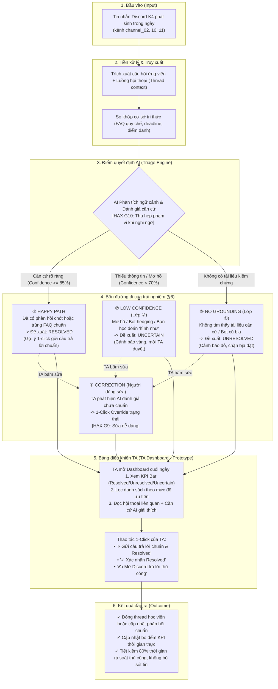

# Sơ đồ Luồng Trải nghiệm Người dùng (UX Flow) — CP2

Ảnh trực quan vector: [user_journey_flow.svg](user_journey_flow.svg)

## 1. Toàn bộ hành trình người dùng (User Flowchart)

## 2. Chi tiết 4 nhánh xử lý ngoại lệ

| Nhánh | Tình huống kích hoạt | Quyết định AI | Hành vi trên UI | Nguyên tắc áp dụng |
|---|---|---|---|---|
| **① Happy path** | Học viên hỏi câu hỏi đã có FAQ (như điểm danh ws) hoặc thread đã được giải đáp xong | `RESOLVED` / Gợi ý chuẩn | Thẻ màu xanh, nút bấm 1-click gửi câu trả lời chuẩn | **HAX G2** (Minh bạch mức độ tin cậy) |
| **② Low confidence** | Câu hỏi mơ hồ ("nghỉ có bị trừ XP không?"), bot trả lời tránh né ("có thể"), hoặc bạn học nói "hình như" | `UNCERTAIN` | Thẻ màu vàng, hiển thị cảnh báo "Chưa có căn cứ chính thức từ TA", đưa vào hàng đợi duyệt | **HAX G10** (Thu hẹp phạm vi khi nghi ngờ - Bắt buộc) |
| **③ No grounding** | Không tìm thấy bất kỳ quy chế nào trong tài liệu hoặc câu hỏi bị bot cũ đoán mò sai | `UNRESOLVED` | Thẻ màu đỏ, thông báo "Không có căn cứ", tuyệt đối không tự sinh text bịa đặt | **HAX G11** (Giải thích rõ vì sao) |
| **④ Correction** | TA phát hiện AI gán nhãn sai (ví dụ học viên cảm ơn lịch sự nhưng lỗi kỹ thuật chưa fix) | Ghi đè trạng thái | Nút 1-click sửa ngay trên UI (`Xác nhận Resolved`, `Chuyển Unresolved`, `Mở lại`) | **HAX G9** (Hỗ trợ sửa lỗi dễ dàng) |
